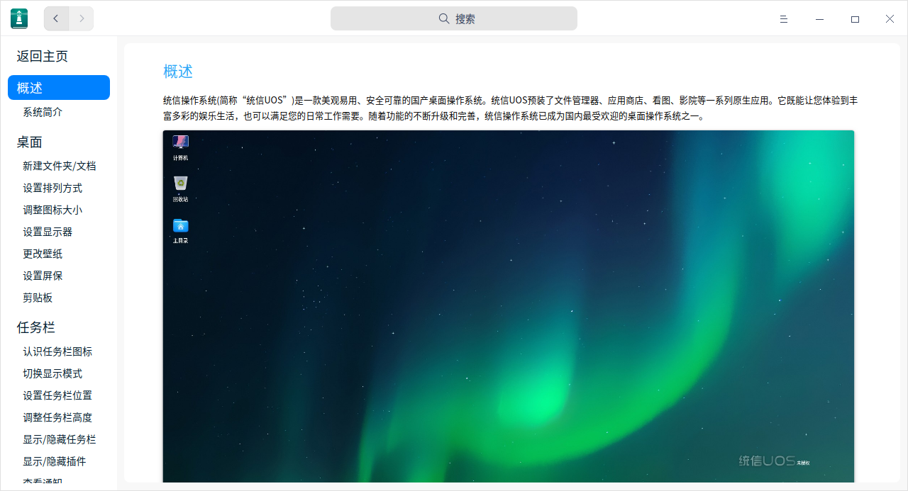

# 获得帮助

## 使用手册

统信UOS使用手册涵盖了如何使用统信操作系统的大量信息。在统信操作系统中，单击 **F1** 可调出对应使用手册。

## 常见问题

在使用统信操作系统的过程中，难免会遇到一些问题。针对系统使用、安装授权和应用软件等常见问题，统信软件提供了解决方法，请参阅 [用户常用问题](https://doc.chinauos.com/content/BLnRdnQB_uwzIp6HT15K)。

## 服务与支持

如果需要协助，统信软件会提供在线咨询、电话呼叫、邮件等多种支持，请参阅 [统信官网技术支持](https://www.uniontech.com/service)。

