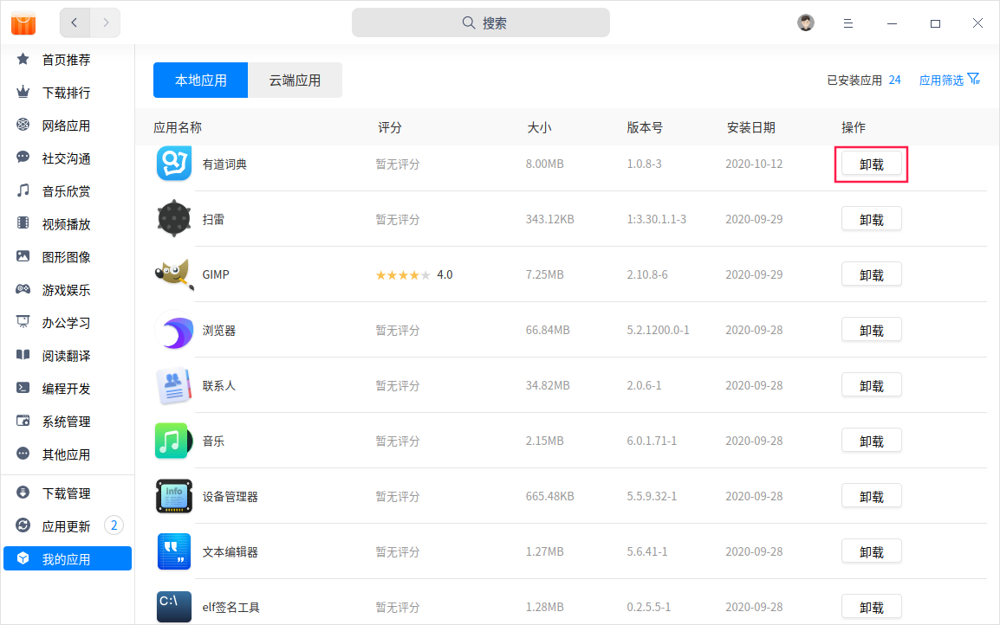

# 使用程序

应用程序提供可视的用户界面，帮助您完成某项或多项特定操作，如截图、绘图、管理文件等。在统信UOS，您可以安装使用数千种应用程序。

## 安装应用

系统预装了一部分应用程序，满足大部分场景的使用需要，您可以在启动器中找到。如果启动器中没有您需要的应用，可以在应用商店一键下载安装。

应用商店是一款集应用展示、下载、安装、卸载、评论、评分、推荐于一体的应用程序。应用商店为您精心筛选和收录了不同类别的应用，每款应用都经过人工安装并验证。您可以进入商店搜索热门应用，一键下载并自动安装。

## 打开应用

安装完成后，在应用商店或启动器中单击应用打开，即可开始使用应用程序。

若应用程序固定在任务栏上，单击图标即可打开应用程序。

还可以在 **控制中心** > **默认程序** 中设置网页、邮件、文本、音乐、视频等文件的默认打开程序，双击此类文件时将自动使用默认程序打开。

## 卸载应用

使用如下方法卸载应用：

- 在应用商店的 **我的应用 **界面，单击 **本地应用**，找到您要卸载的应用，单击 **卸载** 按钮。

- 在启动器中，右键单击要卸载的应用，选择 **卸载**。

