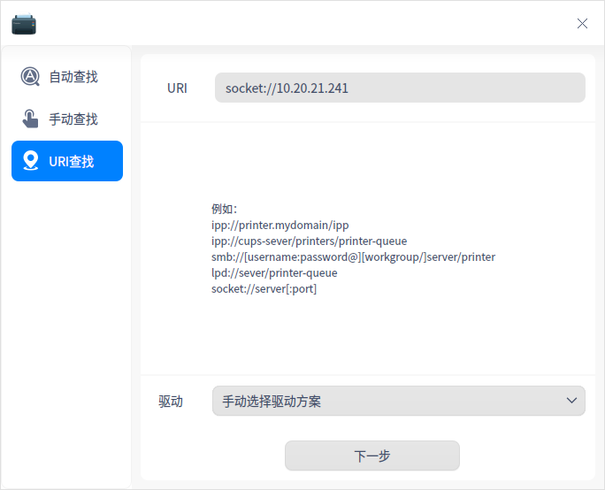
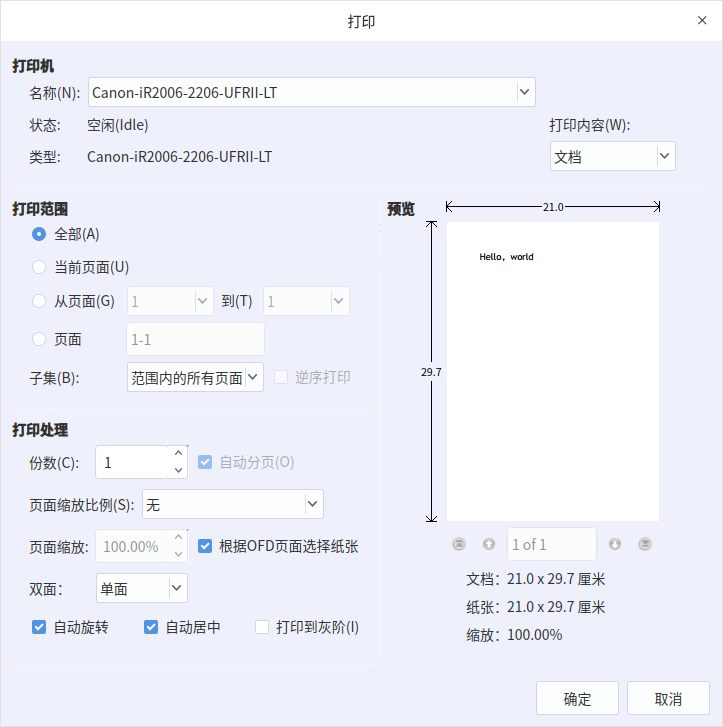

# 打印

统信 UOS 中预装的打印管理器可以同时管理多个打印设备，界面可视化，操作简单。

## 添加打印机

在统信 UOS 启动器中，搜索并运行打印管理器。在打印管理器界面，单击添加按钮 + ，可选择 **自动查找**、**手动查找**、**URI 查找** 方式添加打印机。

### 自动查找

1. 单击 **自动查找** 按钮，会加载出打印机列表，选择需要添加的打印机。

2. 选好打印机后，会加载出驱动列表，默认选择推荐打印机驱动。若选择手动驱动方案，则会跳转到手动选择打印机驱动界面。

   

3. 单击 **安装驱动**，进入安装界面。

### 手动查找

1. 单击 **手动查找** 按钮，输入主机名或IP查找打印机，系统通过各种协议扫描打印机。
   

2. 选好打印机后，会加载出驱动列表，默认选择推荐打印机驱动。若没有加载出驱动列表，则可以选择手动驱动方案。
3. 单击 **安装驱动**，进入安装界面。

### URI查找

1. 在 **自动查找** 和 **手动查找** 的情况下都不能查询到打印机时，可通过URI查找并安装打印驱动。

2. 单击 **URI 查找** 按钮，输入打印机的 URI。

   

3. 系统默认选择手动驱动方案安装，单击 **下一步** ，进入选择驱动界面。

4. 用户选择对应的驱动，单击 **安装驱动**，进入安装界面。

> 说明：使用前提是用户知道打印机的 URI 与使用的协议，然后就可以安装驱动程序来使用打印机。

## 选择驱动

1. 系统默认驱动：选择打印机后，如果有匹配的驱动，系统会默认选择推荐驱动。

2. 手动选择驱动：选择打印机后，选择手动选择驱动，驱动来源有三种。

   * 本地驱动：通过下拉框选择厂商及型号，查询本地驱动。

   

   * 本地 PPD 文件：将本地文件 PPD 文件拖放到对应地方，或单击 **选择一个 PPD 文件** 在本地文件夹查找，比如在 `/usr/share/ppd` 目录下选择 ppd 文件。

   > 说明：使用前提是用户必须在本地安装了驱动，才可以使用 PPD 文件安装。否则，会提示驱动安装失败。

   

   * 搜索打印机驱动：输入精确的厂商和型号，系统会在后台驱动库中搜索，搜索结果会显示在下拉框中。

   

## 安装打印机

添加打印机选择驱动后，单击 **开始安装**，直到系统提示安装成功。

## 管理打印机

打印机安装成功后，在打印管理器界面可选择属性设置、打印队列、打印测试页、查看耗材及故障排查。

## 文件打印

如果您要打印 pdf 或其他类型的文件， 单击打印按钮进入打印设置页面。选择对应的打印机并设置相关参数后就可以开始打印了。

