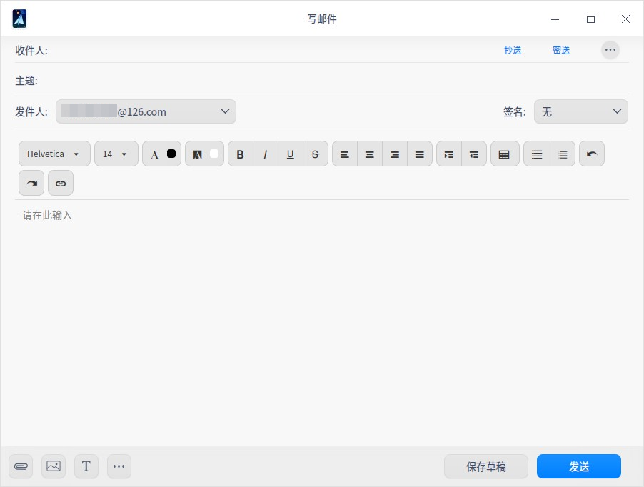
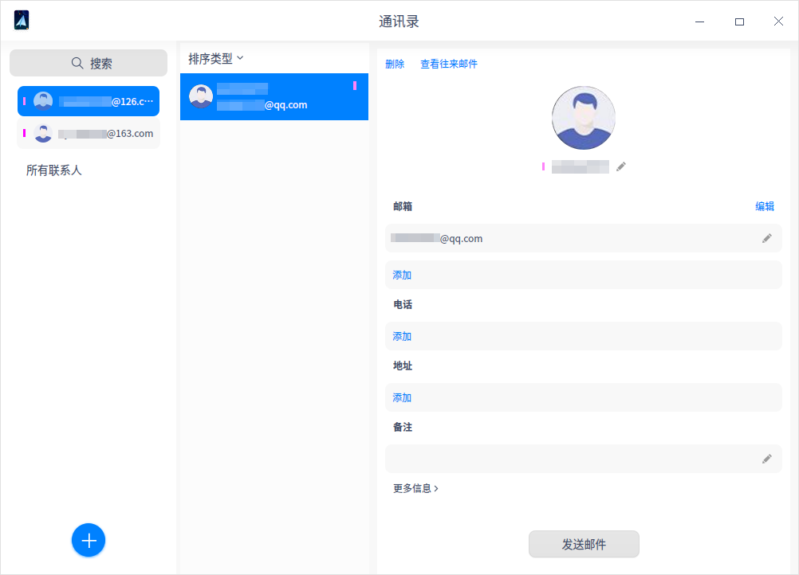

# 邮箱入门

统信UOS中预装的邮箱可以同时管理多个邮箱帐号，并支持IMAP和POP3协议。

## 登录邮箱

1. 在统信UOS启动器中，搜索并运行邮箱。在邮箱登录界面输入邮箱帐号、密码或授权码后，单击 **登录**。

   

2. 程序会自动检测输入的邮箱后缀是否在服务器数据库中：

   - 如果邮箱后缀在服务器数据库中，则可直接登录；

   - 如果邮箱后缀不在服务器数据库中，则需单击 **手动配置** 手动添加。

     

> 说明：QQ邮箱、网易邮箱（163.com及126.com）、新浪邮箱等需要开启POP3/IMAP/exchange等服务后才可以在邮箱中使用。开启服务后，服务端会产生授权码。在登录界面输入邮箱帐户及授权码即可登录邮箱。如果登录失败，单击 **查看帮助** 则可查看帮助信息。

> 

## 写邮件

1. 在邮箱主界面，单击写邮件按钮，进入写邮件界面。

2. 输入收件人邮箱帐号，或**单击** 从通讯录添加收件人，还可以选择抄送或密送。

3. 邮件正文支持富文本编辑，包括插入图片、链接等功能，还支持签名功能。

4. 编辑完成后，单击 **发送 **即可。

   

## 收邮件

收邮件是从服务器同步邮箱数据，包括邮件，地址簿，日历等信息，系统默认每15分钟同步1次邮箱数据。以下介绍两种收邮件的方式：

- 选中邮箱帐户，单击收取邮件按钮。
- 选中邮箱帐户并单击右键，选择 **收取邮件**。

## 筛选邮件

邮件筛选功能可以帮您快速的找到需要的邮件。

1. 单击 **所有邮件**，显示筛选条件为：所有邮件、未读邮件、星标邮件、含附件及@我。

   

2. 选中后，邮件列表只显示符合条件的邮件。

   > 说明：如果需要更精确的搜索，可以直接单击输入关键字搜索邮件。 

3. 在邮件列表中可以选择单个或多个邮件。

 - 选中单个邮件：鼠标左键单击邮件即可选中单个邮件；

 - 选中多个邮件：

   - 按住 **Ctrl** 键，用鼠标左键依次单击邮件，可选中的多个邮件；

   - 用鼠标左键单击A邮件，然后按住 **shift** 键 ，再用左键单击B邮件，可选中从A到B之间的所有邮件。

## 删除邮件

删除邮件可以选择单个删除或批量删除，一般删除的邮件会存放到 **已删除** 目录，还可以选择永久删除。

### 单个删除

单个删除邮件有两种方式，删除后的邮件会存放到 **已删除** 目录。

- 在邮件列表选中邮件并单击右键，选择 **删除**。
- 在邮件正文中，单击删除按钮。

删除完后，可以在 **已删除** 目录中永久删除邮件。

### 批量删除

选中要删除的邮箱目录并单击右键，选择 **批量删除**，你可以根据时间范围，如删除一周前，一个月前的邮件等。

## 导入邮件

在邮箱目录列表中，选中邮箱目录并单击右键，选择 **导入邮件**。弹出文件管理器窗口，选择需要导入的邮件后，单击 **打开** 即可导入到指定目录。

## 导出邮件

导出邮件可以单独导出，也支持批量导出。

### 单个导出

单个导出邮件有两种方式：

- 在邮件列表选中邮件并单击右键，选择 **导出**。

- 在邮件正文中，单击更多操作按钮后，选择 **导出**。

在文件管理器中选择存储路径后单击 **保存**。

### 批量导出

选中指定的邮箱目录并单击右键，选择 **导出邮件**，弹出文件管理器窗口，选择存储路径后单击 **保存**。

## 通讯录

在邮箱主界面，单击通讯录按钮，进入通讯录界面。可查看通讯录列表及联系人的信息，同时可补充联系人电话号码、地址等信息，单击还可添加新联系人。

## 邮箱设置

### 帐号设置

邮箱帐号：增加或删除邮箱帐号，单击 **添加帐号**，可继续添加新的邮箱帐号。单击 **编辑** 后，可选择删除邮箱帐号。

邮箱信息：显示发件人头像、姓名及邮箱协议，还可以更换头像及服务器设置。

签名：主要是向收件人提供更多联系信息，以及额外的品牌展示信息。您可以根据需求选择公司签名、个人签名或自定义签名。

### 基本设置

快捷键：邮箱中常用操作的快捷键。

常规设置：邮箱开机启动、收件提醒及收件时间间隔等的基本设置。

### 反垃圾设置

黑名单：在黑名单列表里的邮箱发过来的邮件全部拒收，可添加、导出及导入黑名单。

白名单：在白名单列表里的邮箱发过来的邮件全部接收，可添加、导出及导入白名单。

### 高级设置

基于邮箱数据安全考虑，建议开启安全锁，设置开启密码。当鼠标和键盘超过15分钟未操作，邮箱将自动锁定，唤醒时需要输入开启密码。