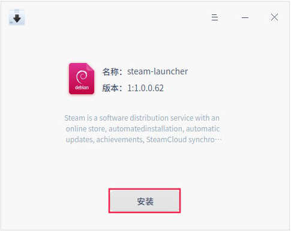
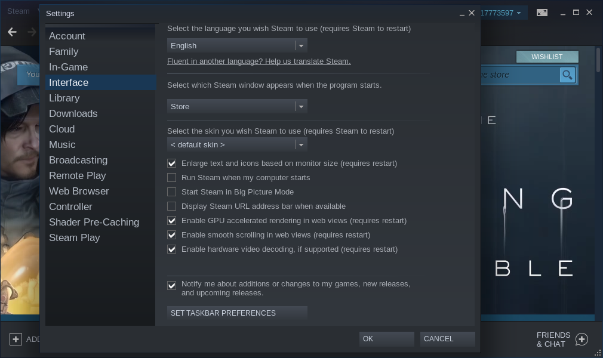
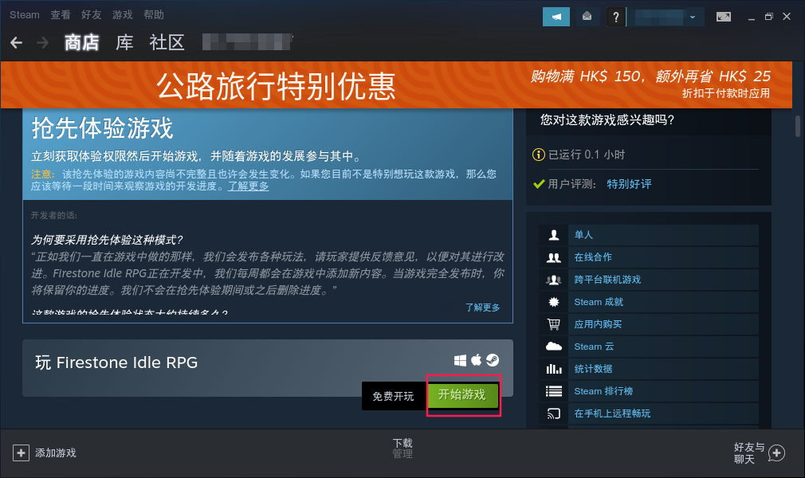

# 了解统信UOS游戏

在统信UOS中，您可以在应用商店中下载并畅玩游戏，还可以通过Steam平台购买、下载、分享游戏和软件。Steam平台是目前全球较大的综合性数字游戏软件发行平台，提供VAC反作弊系统、自动更新系统、好友系统、服务器浏览器、游戏列表、游戏截图、视频分享等功能。

## 下载并安装Steam

1. 在统信UOS中使用Steam游戏平台，需要通过官网下载对应的.deb格式的安装包来进行安装。进入Steam官网后，单击【安装STEAM】按钮，默认下载的就是.deb格式的安装包。

   

2. 双击下载的steam软件包，进入软件包安装器，单击 **安装** 按钮，即可进行安装。

   

## 创建并登录帐号

1. 在统信UOS的启动器中，搜索并运行Steam。如果已有帐户，单击 **LOGIN TO AN EXISTING ACCOUT** 按钮进入登录界面，输入Account name（帐户）和Password（密码）后单击 **LOGIN **按钮即可登录。

   

2. 如果没有帐号需要单击 **CREATE NEW ACCOUNT** 按钮来创建新的帐号。

3. 验证注册邮箱后即可成功创建帐号。

## 设置中文界面

登录帐户后，Steam平台默认显示为英文界面，在使用的过程中可能会不太方便。因此在使用前还需要先将界面设置为中文界面。

1. 选择 **Steam-Settings**，进入Settings（设置）界面，在左侧列表选择 **Interface**，设置界面语言为 **简体中文**并单击 **OK** 按钮。

   

2. 重启Steam后显示为中文界面。

## 开启Windows游戏运行支持

1. 选择 **Steam-Settings**,入Settings（设置）界面，在左侧列表选择 **Steam Play**, 选勾 **Enable Steam Play for all other titles** ,Run other titles with 下拉列表选 Proton 6.3-2 并单击 **OK** 按钮

## 搜索并下载游戏

1. 在steam主界面选择 **商店->精选**，进入官方精选和推荐游戏界面，可以快速检索或浏览平台当前精选和推荐的游戏。

2. 以下载Firestone Idle RPG为例，介绍如何下载游戏。在商店中找到Firestone Idle RPG后，单击游戏封面进入游戏详情界面。

   

3. 单击 **开始游戏** 按钮，弹出游戏安装界面，显示所需和可用的硬盘空间大小，根据情况可选择勾选在桌面或任务栏创建快捷方式。

   

4. 单击**下一步**按钮，显示游戏下载进度，等待游戏下载完成后，单击 **完成** 按钮。

窍门：选择 **帮助->Steam客服**，进入Steam客服界面可以获取帮助。

