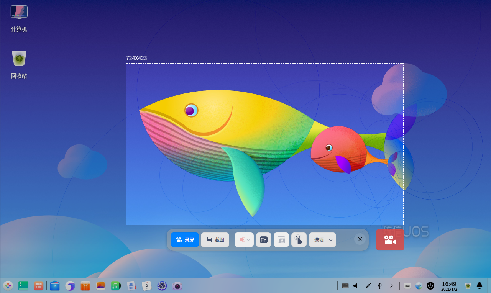

# 使用截图录屏

日常使用电脑的过程中，经常会用到截图、录屏的小工具。统信UOS系统自带的截图录屏软件将二者结合，用户只需调用快捷键便可操作使用。截图录屏不仅支持多种方式来选择截图录屏的区域，还支持对图片进行编辑，录制动图等功能。

## 截图

1. 使用快捷键 **Ctrl + Alt + A** 进入截图模式。

   - 移动光标至桌面，选中整个屏幕，单击桌面显示工具栏。
   - 移动光标至应用窗口，选中该窗口，单击应用窗口显示工具栏。
   - 拖动鼠标不放来自定义截图区域，释放鼠标完成区域选择，显示工具栏。

2. 单击工具栏上的图标，可打开属性面板，可选择粗细、颜色或马赛克工具。
3. 在选项下拉菜单中选择存储路径，或图片格式。
4. 单击  或 快捷键 **Ctrl + S** 保存截图。

## 录屏

1. 使用快捷键 **Ctrl + Alt + R** 进入录屏模式。
   - 移动光标至桌面，选中整个屏幕，单击桌面显示工具栏。
   - 移动光标至应用窗口，选中该窗口，单击应用窗口显示工具栏。
   - 拖动鼠标不放来自定义截图区域，释放鼠标完成区域选择，显示工具栏。
2. 单击工具栏的图标设置声音、按键显示、摄像头、显示点击等。
3. 在“选项”下拉菜单中选择录屏格式或帧率，录屏支持GIF、MP4、MKV格式。
4. 单击  ，3秒倒计时结束后开始录制屏幕。
5. 单击托盘区域录屏图标或使用快捷键 **Ctrl + Alt + R **结束录屏。

