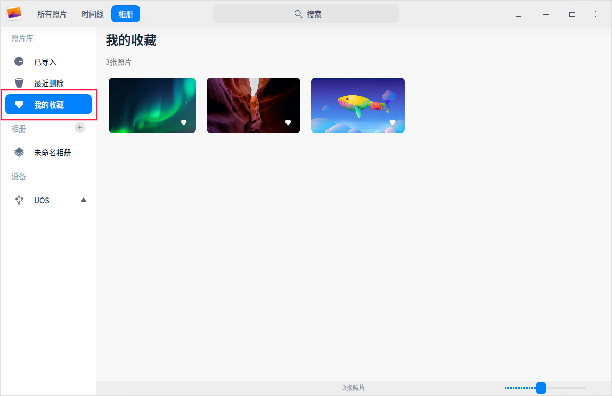

# 使用数字图片

用户可以使用看图、相册等应用查看和管理图片。

## 看图

看图是一款小巧的图片查看软件，支持多种图片格式，不仅可以查看图片，还支持更多其他功能：

- 在工具栏上单击旋转按钮调整图片方向。
- 在工具栏上单击视图按钮，显示导航窗口，移动导航窗口内的方框，查看该区域的信息。
- 右键单击图片，可**打印**图片、将图片**设为壁纸**、查看**图片信息**等。

## 相册

用户可以通过电子相册管理照片，记录生活中的点滴。

### 导入照片

相册既支持将本地照片导入相册，也支持将移动设备中的照片导入相册。
- 从本地导入照片
   - 单击 主菜单 >  **导入照片**。
   - 直接将照片或所在文件夹拖拽到界面上。
   - 当相册中尚无照片时，单击 导入照片。

- 从移动设备中导入照片
1. 当检测到有移动设备接入时，设备栏将展示移动设备。
2. 在“导入到”下拉框中选择一个相册导入，单击 **全部导入** 或 **导入**。

### 管理照片

#### 通过时间线管理照片

在时间线界面，所有照片按日期划分，用户可以通过日期快速找到相应的照片。

#### 通过建立相册管理照片

用户可以建立多个相册，将不同类别的照片移至对应的相册中。

1. 在相册界面，单击左侧栏相册 + 按钮新建相册；或者右键单击相册选择 **新建相册**；或选择 主菜单 > **新建相册**。
2. 右键单击照片选择 **添加到相册**，将照片移至其他相册中。

#### 通过“我的收藏”管理照片

用户可以将喜爱的照片添加至“我的收藏”中，以后只需单击左侧栏“我的收藏”便可快速找到自己喜欢的照片。

+ 右键单击照片，选择 **收藏**。
+ 在查看图片的界面上，单击工具栏上的  按钮收藏照片。

