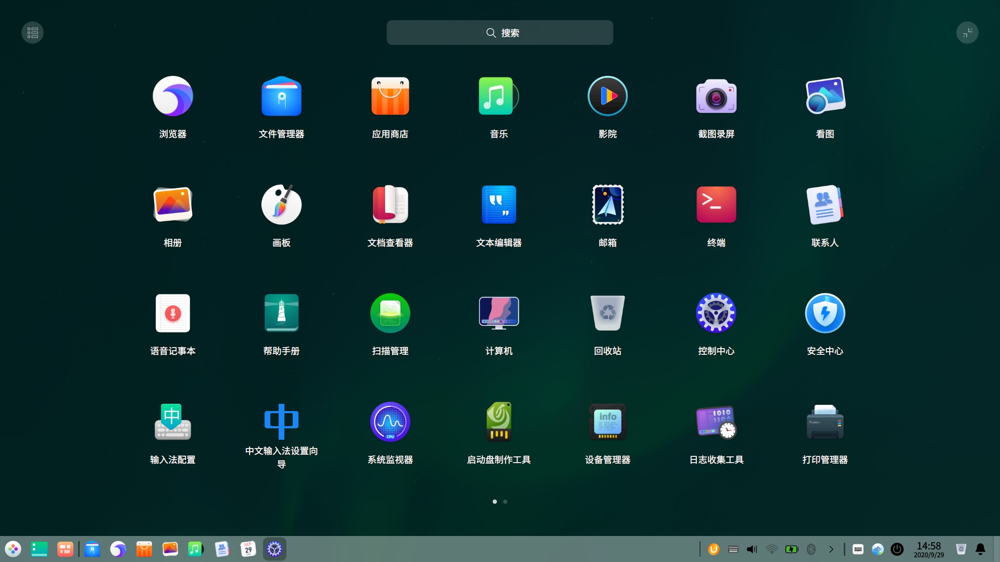
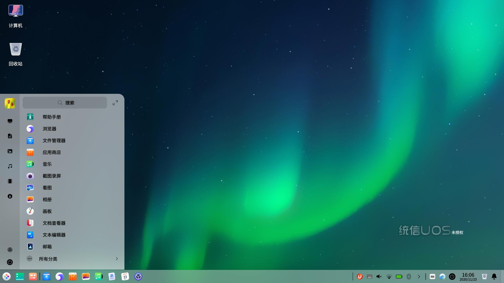
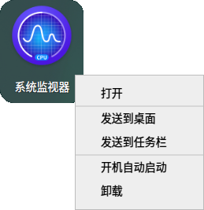

# 启动器

启动器  帮助您管理系统中已安装的所有应用，在启动器中使用分类导航或搜索功能可以快速找到您需要的应用程序。

您可以进入启动器查看新安装的应用。新安装应用的旁边会出现一个小蓝点。

> 说明：在触控板上（触控板支持多点触控），您可以使用手势代替鼠标操作：四指/五指单击，显示/隐藏启动器， 对应 **Super** 快捷键。

## 切换模式

启动器有全屏和小窗口两种模式。单击启动器界面右上角的图标来切换模式。

两种模式均支持搜索应用、设置快捷方式等操作。

小窗口模式还支持快速打开文件管理器，控制中心和进入关机界面等功能。

## 排列应用

在全屏模式下，系统默认按照安装时间排列所有应用。

- 将鼠标悬停在应用图标上，按住鼠标左键不放，将应用图标拖拽到指定的位置自由排列。
- 单击启动器界面左上角分类图标进行排列。

&nbsp;&nbsp;&nbsp;&nbsp;&nbsp;&nbsp;&nbsp;&nbsp;&nbsp;&nbsp;&nbsp;&nbsp;&nbsp;

在小窗口模式下，默认按照使用频率排列应用。

## 查找应用

在启动器中，您可以滚动鼠标滚轮或切换分类导航查找应用。

如果知道应用名称，直接在搜索框中输入关键字，快速定位到需要的应用。

## 设置快捷方式
快捷方式提供了一种简单快捷地启动应用的方法。

### 创建快捷方式
将应用发送到桌面或任务栏上，方便您的后续操作。

在启动器中，右键单击应用图标，您可以：

- 单击 **发送到桌面**，在桌面创建快捷方式。

- 单击 **发送到任务栏**，将应用固定到任务栏。

> 说明：您还可以从启动器拖拽应用图标到任务栏上放置。但是当应用处于运行状态时您将无法拖拽固定，此时您可以右键单击任务栏上的应用图标，选择 **驻留** 将应用固定到任务栏，以便下次使用时从任务栏上快速打开。

### 删除快捷方式
您既可以在桌面直接删除应用的快捷方式，也可以在任务栏和启动器中删除。

#### **从任务栏上删除**

- 在任务栏上，按住鼠标左键不放，将应用图标拖拽到任务栏以外的区域移除快捷方式。
- 当应用处于运行状态时您将无法拖拽移除，此时可以右键单击任务栏上的应用图标，选择 **移除驻留** 将应用从任务栏上移除。

#### **从启动器中删除**

在启动器中，右键单击应用图标，您可以：

- 单击 **从桌面上移除**，删除桌面快捷方式。
- 单击 **从任务栏上移除**，将固定到任务栏上的应用移除。

> 说明：以上操作，只会删除应用的快捷方式，而不会卸载应用。

## 安装应用
如果启动器中没有您需要的应用，可以在应用商店一键下载安装。

## 运行应用
对于已经创建了桌面快捷方式或固定到任务栏上的应用，您可以通过以下途径来打开应用。

- 双击桌面图标，或右键单击桌面图标选择 **打开**。
- 直接单击任务栏上的应用图标，或右键单击任务栏上的应用图标选择 **打开**。

在启动器中，直接单击应用图标打开，或右键单击应用图标选择 **打开**。

> 窍门：对于经常使用的应用，您可以在启动器中，右键单击应用图标选择 **开机自动启动**。

## 卸载应用
对于不再使用的应用，您可以选择将其卸载，以节省硬盘空间。

1. 在启动器中，右键单击应用图标。
2. 单击 **卸载**。

> 窍门：在 **时尚模式** 下，您还可以在启动器的全屏模式界面，按住鼠标左键不放，将应用图标拖拽到任务栏的  中卸载应用。

