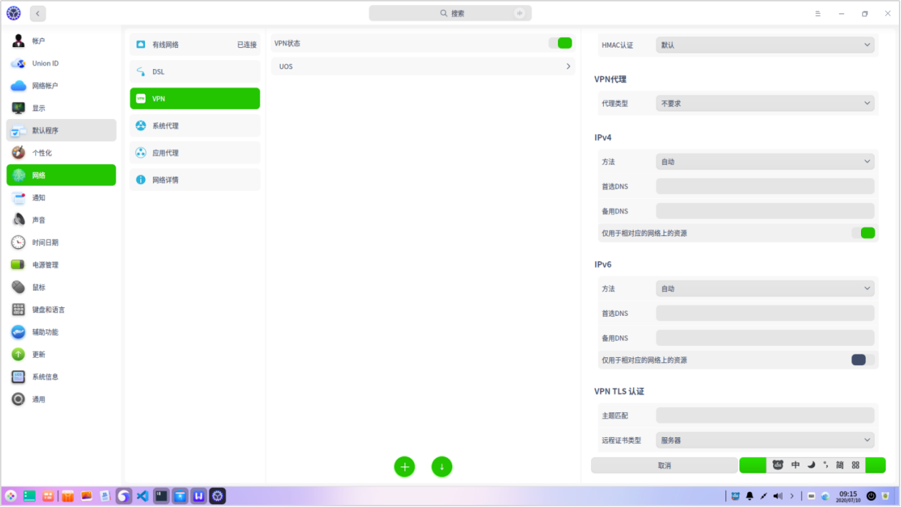

# 无线网络连接常见问题

## 1.网络只能访问内网，无法访问外网

问题描述：本地网络可以正常上网，但在连接公司VPN后只能访问公司内网，无法访问其他网页。

原因分析：在默认情况下，配置连接VPN后，统信UOS默认网关会被修正成VPN配备的网关，如果VPN配备网关没有配置转发外网数据时，用户就不能访问外网。

解决方法：打开控制中心，选择【网络】，单击【VPN】。在VPN设置界面中选择已配置的VPN，进入详细参数设置界面，在IPv4设置区域开启【仅用于相对应的网络上的资源】功能，单击【保存】按钮，如图VPN设置所示。

 

## 2. WiFi和蓝牙共存不稳定问题

问题描述：WiFi和蓝牙共存时网络不稳定

原因分析：一些芯片中可能同时集成了WiFi模块和蓝牙模块， WiFi和蓝牙共用时会导致无线电冲突，因此要对一些配置进行修改。

解决方法：如果使用蓝牙时，WiFi速度很慢，执行如下步骤进行修改。
1. 打开终端，执行命令sudo nano /etc/modprobe.d/iwlwifi.conf，将配置文件iwlwifi.conf里面的内容修改为“options iwlwifi 11n_disable=1 bt_coex_active=0 power_save=0 swcrypto=1”。
2. 保存配置文件并重启系统。

> 窍门：在终端中执行命令modinfo iwlwifi，可以了解每个参数的意义。

## 3. 无线网络非常慢或者长时间不响应

问题描述：如果在使用windows系统时，一切正常，说明机器的硬件是正常的，但安装统信UOS后出现无线网络非常慢或网络长时间不响应。

原因分析：在初次安装统信UOS后，如果经常出现无线网络非常慢或者网络长时间不响应的状况，很大程度的原因是没有安装对应的驱动。

解决方法：如果确认是驱动原因导致网络不响应，可按以下步骤处理。否则，以下方法并不适用。

1. 在终端中输入命令lspci|grep Wireless，查看驱动型号。
2. 在网站“Linux Wireless”下载对应驱动。

   > 说明：“Linux Wireless”网站罗列了大部分Linux的无线网卡驱动，用户可以根据实际情况选择所需要的网卡型号，并搜索对应的驱动。

3. 安装驱动。

- 如果为Intel网卡如Intel® Wireless 8265，根据官网提示，执行如下命令。

tar xf xxx.tgz

sudo cp iwlwifi-*.ucode /lib/firmware

sudo reboot

- 如果为Realtek网卡如rtl8192du，还需要下载源码，编译后再进行安装，执行如下命令。

git clone https://github.com/lwfinger/rtl8192du.git

cd rtl8192du

make

sudo make install

sudo modprobe rtl8192du

sudo reboot

