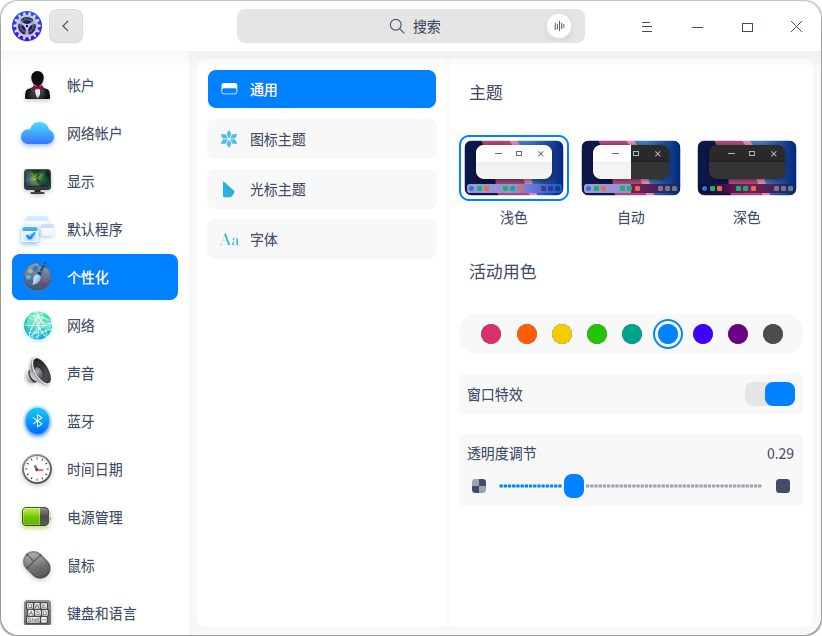

# 个性化系统UOS

在控制中心个性化设置模块可以进行一些通用的个性化设置，包括系统主题、活动用色、字体、窗口特效和透明度，改变桌面和窗口的外观。除此之外还可设置图标主题、光标主题和字体，操作方法如下。

1. 在控制中心首页，单击单击【个性化】按钮，默认进入通用设置界面，如图所示。

2. 单击选择一种窗口主题，该主题即可设置为系统窗口主题。

3. 活动用色是指选中某一选项时的强调色，单击活动用色下的一种颜色，可实时查看该颜色在系统中的显示效果。

4. 打开【窗口特效】开关，可以让桌面和窗口更美观精致。

5. 窗口特效开启后才能拖动透明度调节下的滑块，可实时查看透明效果。通过透明度调节来设置任务栏和启动器（小窗口模式）的透明度，滑块越靠左越透明，越靠右越不透明。

 

个性化界面

> 窍门：自动主题表示根据当前时区日出日落的时间自动更换窗口主题，日出后是浅色，日落后是深色。

类似地，在个性化设置界面上，还可以完成图标主题、光标主题和系统字体的设置。