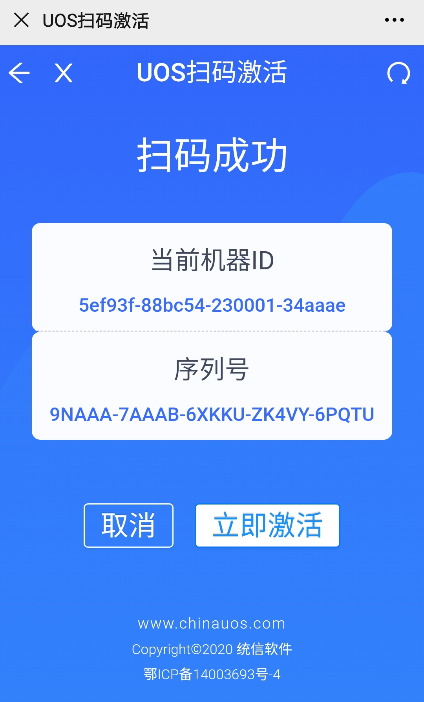

# 激活统信UOS系统

当用户使用的是桌面专业版统信UOS系统时，如果系统未激活，可以采用如下方式激活系统。

## 系统未激活状态查询

未激活状态分为两种未激活和过期未激活。
- 未激活：界面包括产品名称、产品版本和授权状态信息。
- 过期未激活：在截止时间内未激活系统，界面包括产品名称、产品版本、授权状态、授权对象和截止日期信息。

1. 单击右下角托盘上的 进入界面。
2. 打开 **控制中心**，选择 **系统信息**，单击 **关于本机**。
3. 查看版本授权栏，单击 **激活** 进入页面。

> 说明：如果系统未激活，授权管理图标 一直常驻在右下角托盘，开机即显示。

## 激活方式

激活方式分在线激活和离线激活，而在线激活方式包含试用期激活、输入序列号、导入激活文件。

> 注意： 只有在试用期或被激活成功的系统，才能正常使用统信UOS的所有功能，否则会有部分功能受到限制。

### **在线激活**

在线激活的前提是系统网络连接正常。

#### 试用期激活

在线/离线场景下都是开机自动激活系统，每台设备仅有一次试用期激活机会，从激活当天算起，有效期为90天。试用期间可使用系统全部功能。

1. 单击右下角托盘上的 进入界面。

   

2. 单击 **试用期激活**，跳转到激活界面。

3. 单击 **立即激活**，会弹出二次确认弹框，单击 **确定**，弹出试用期激活成功界面，任务栏图标变为。

4. 在此界面，可查看试用到期时间等信息，也可以选择永久激活系统。

   

#### 输入序列号

1. 单击右下角托盘上的 进入界面。

2. 单击 **输入序列号**，输入或复制正确的序列号，单击 **立即激活**。
   > 说明：统信UOS既支持16位的序列号，也支持25位的序列号。

   

3. 在弹出二次确认框中，单击 **确定**，弹出激活成功界面。

#### 导入激活文件

1. 单击右下角托盘上的 进入界面。

2. 单击 **导入激活文件**，弹出文件管理器，选择.key格式的激活文件。

   

3. 选择正确的文件，单击 **立即激活**。

4. 在弹出二次确认框中，单击 **确定**，弹出激活成功界面。

### **离线激活**

离线激活的前提是系统网络连接异常。

1. 选择输入序列号或导入授权文件激活时，系统检测网络连接异常，则跳转到离线激活界面。

2. 离线激活界面显示二维码、序列号、机器ID及离线激活码输入框。

   

3. 手机扫描二维码，手机端弹出激活界面，界面显示当前机器ID及序列号。

   

4. 单击 **立即激活**，弹出二次确认框，单击 **确定**。

5. 跳转到激活成功界面，显示机器ID、序列号和离线激活码。

   

6. 手动将手机端的离线激活码输入电脑端的离线激活码输入框。

   

7. 单击 **离线激活**，跳转到激活成功界面。

### 激活成功与失败的显示情况

#### 激活成功

1. 激活成功界面显示产品名称、产品版本和激活方式等信息。
 - 产品名称：操作系统的名称。
 - 产品版本：操作系统的版本。
 - 授权状态：授权状态分为未授权、已过期、已授权，激活成功显示已授权。
 - 授权对象：被授权的用户名称。
 - 激活方式：激活方式分为序列号、激活文件及离线激活码，根据实际激活方式体现。
 - 到期时间：超过了截止时间，系统会提醒授权即将到期。

2. 系统激活成功后，右下角托盘不再显示授权管理图标，可通过控制中心查看授权管理工具。

#### 激活失败

若激活文件已使用或已失效，则会弹出激活失败界面。

#### 激活服务器设置

如果当前激活服务器出现异常或崩溃了，通过授权管理界面，单击主菜单  中的 **设置**，可以自定义新的激活服务器。