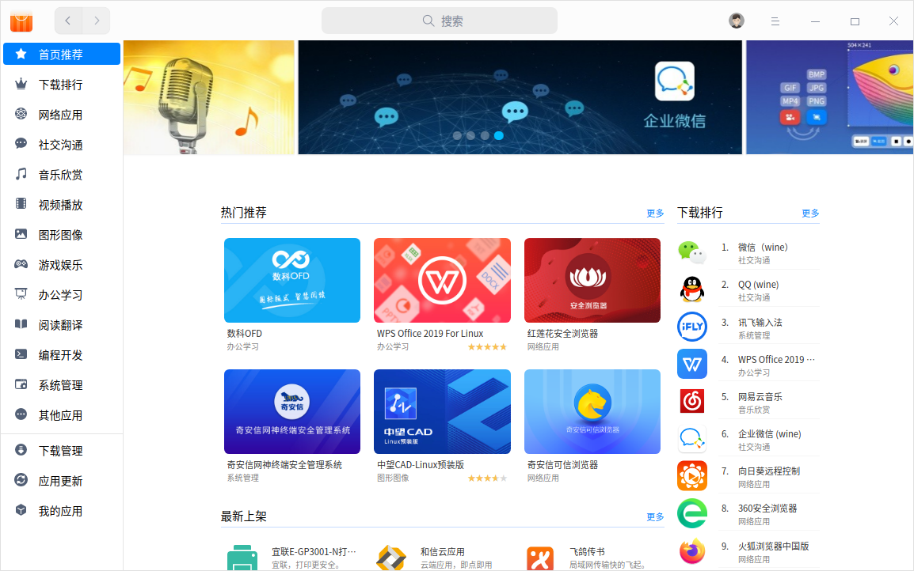

# 安装程序

系统预装了一部分应用程序，满足大部分场景的使用需要，您可以在启动器中找到。如果启动器中没有您需要的应用，可以在应用商店一键下载安装。

## 从应用商店安装

应用商店是一款集应用展示、下载、安装、卸载、评论、评分、推荐于一体的应用程序。应用商店为您精心筛选和收录了不同类别的应用，每款应用都经过人工安装并验证。您可以进入商店搜索热门应用，一键下载并自动安装。

## 用软件包安装器安装

您还可以使用软件包安装器来安装应用程序，但必须先启用开发者模式。

### 开启开发者模式

启用开发者模式后，您可以使用root权限，执行sudo操作，安装和运行未在应用商店上架的非签名应用。但可能破坏系统完整性，且不再享有官方报修服务，请谨慎加入。

1. 在 **控制中心** > **通用** >**开发者模式**，单击 **进入开发者模式** 按钮。
   - 若选择在线模式，请先登录Union ID帐户。仔细查看开发者模式免责声明，了解注意事项后，勾选 **同意并进入开发者模式**，单击 **确定**。待系统下发证书后，按钮变为 **已进入开发者模式**。
   - 若选择离线模式，根据提示下载证书，待系统导入证书后，即可进入开发者模式。
3. 在弹出的对话框中单击 **现在重启**， 重启系统后开发者模式生效。

> 注意：进入开发者模式后不可退出或撤销。系统所有帐号都将拥有root权限。

### 安装deb包

1. 从应用官网上下载deb格式的安装包。
2. 双击deb包，打开软件包安装器。
3. 在密码验证窗口中输入密码。
4. 点击 **安装**，等待安装成功。