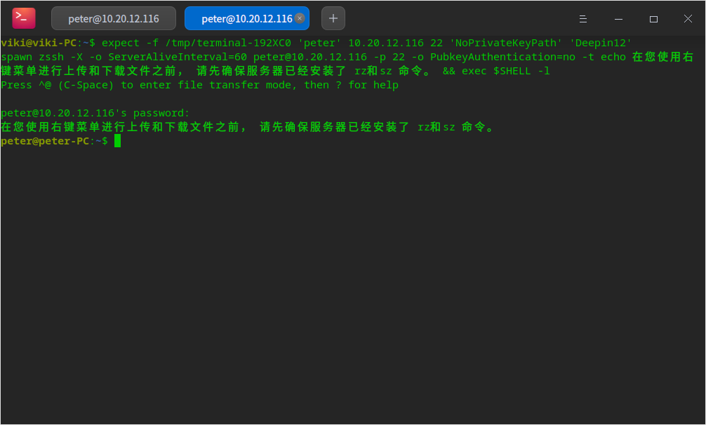
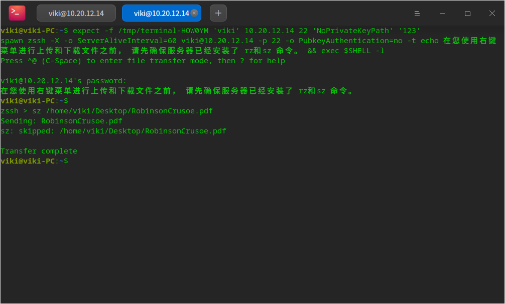

# 从其他计算机传输文件和设置

## 共享文件夹

在工作中，我们常常需要文件互传，有时也会遇到文件太大无法传输或传输较慢，我们可以使用共享文件夹相互访问。以下介绍局域网如何共享和访问共享文件夹。

1. 右键单击文件夹选择 **共享文件夹**，勾选“共享此文件夹”复选框。
2. 在主菜单中选择 **设置共享密码**，为该文件夹设置共享密码。
3. 其他用户访问该文件夹，需要在其文件管理器地址栏中输入访问地址（smb://xxIP地址）。
4. 单击共享文件夹，弹出对话框，输入共享者系统用户名及文件夹的共享密码，访问该文件夹。

## 使用终端上传下载文件

用户可在终端中登录服务器，将文件上传到服务器中，同一局域网中的其他用户可登录服务器，将文件下载下来。

用户可打开终端帮助手册参考 **添加服务器** 章节。

1. 在终端界面右键单击选择 **远程管理**，选择一个服务器并登录。

2. 右键单击选择 **上传文件** 或将文件拖拽到终端中。

3. 局域网中的其他用户在终端中添加该服务器并登录，右键单击选择 **下载文件**。
4. 在弹出的文件管理器窗口中选择存储路径。
5. 在终端中输入需要下载的文件地址，并执行命令。

### 使用蓝牙传输文件

若电脑配置了蓝牙模块，便可通过蓝牙进行短距离文件传输的操作。

前提条件：发送端与接收端蓝牙设备已配对并成功连接，具体连接方式参考DDE帮助手册中关于“连接蓝牙设备”章节。

1. 在文件管理器界面，右键单击需要发送的文件。
2. 选择 **发送到** > **发送到蓝牙**。
3. 在弹出的蓝牙文件传输对话框中勾选接收设备，点击 **下一步**。
4. 此时接收端会收到文件接收的请求，待接收端同意请求后，发送端开始传输文件。

>说明：若需要传输文件夹，可提前将文件夹压缩后再通过蓝牙发送。