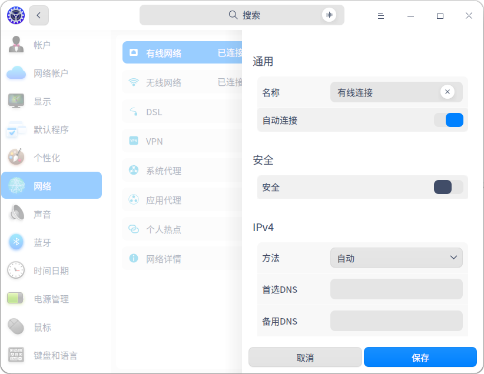
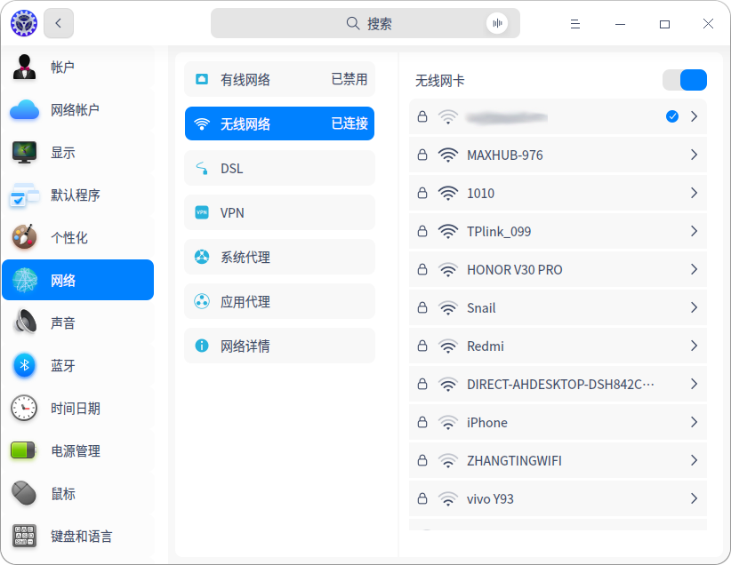
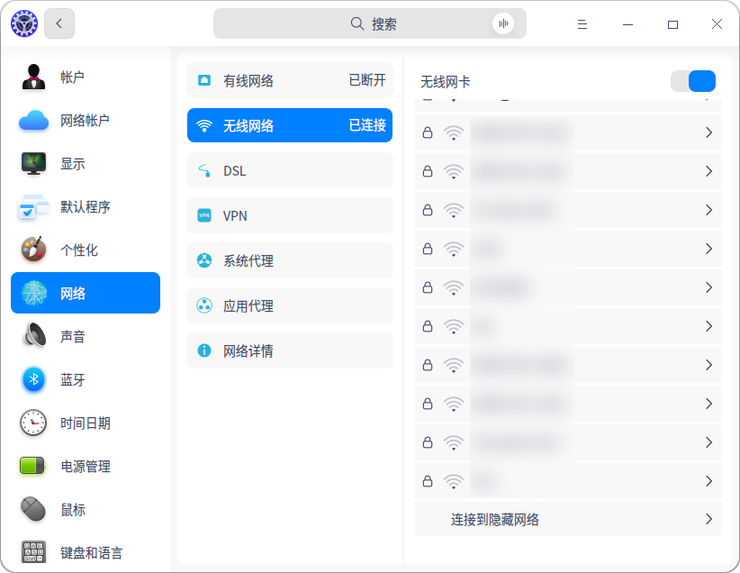
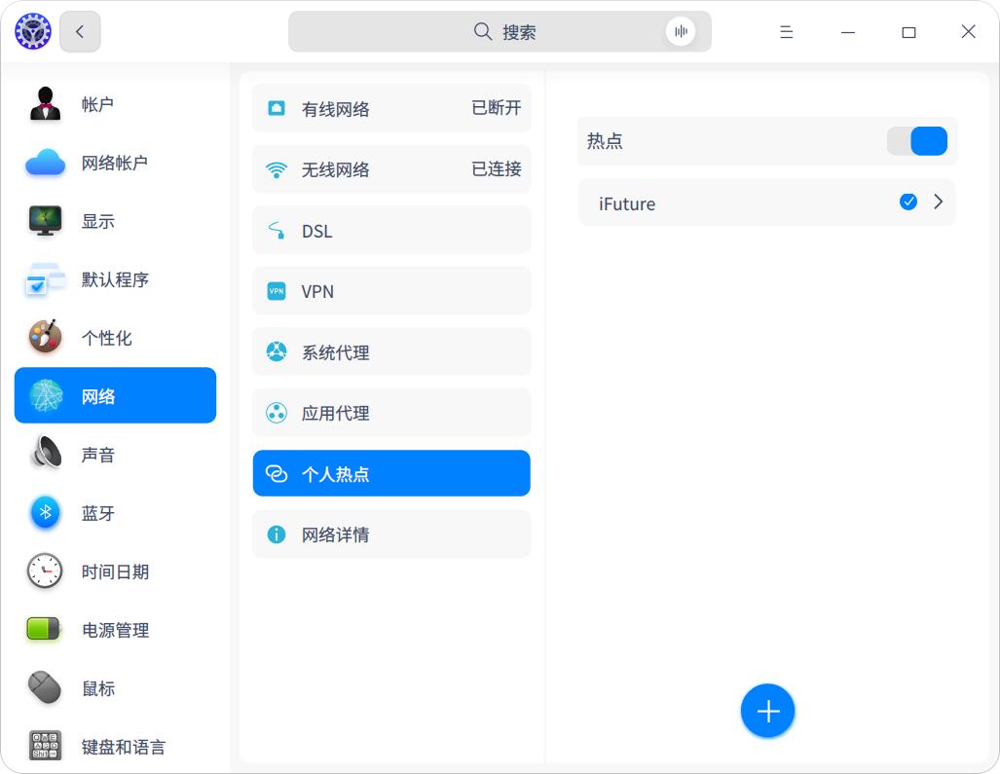
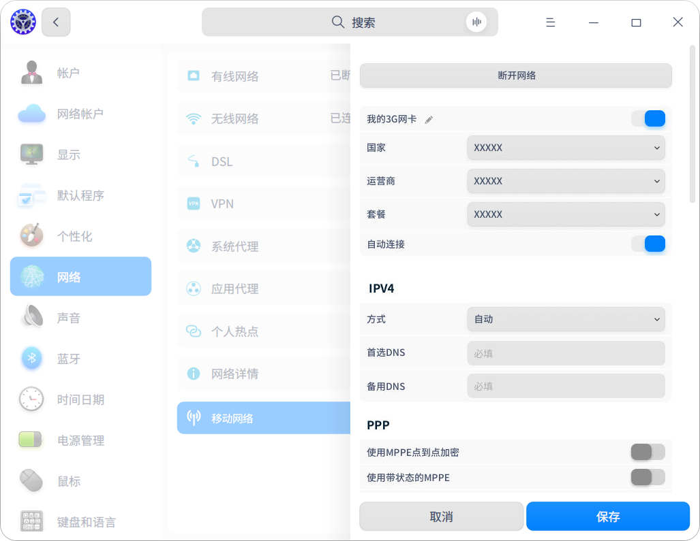
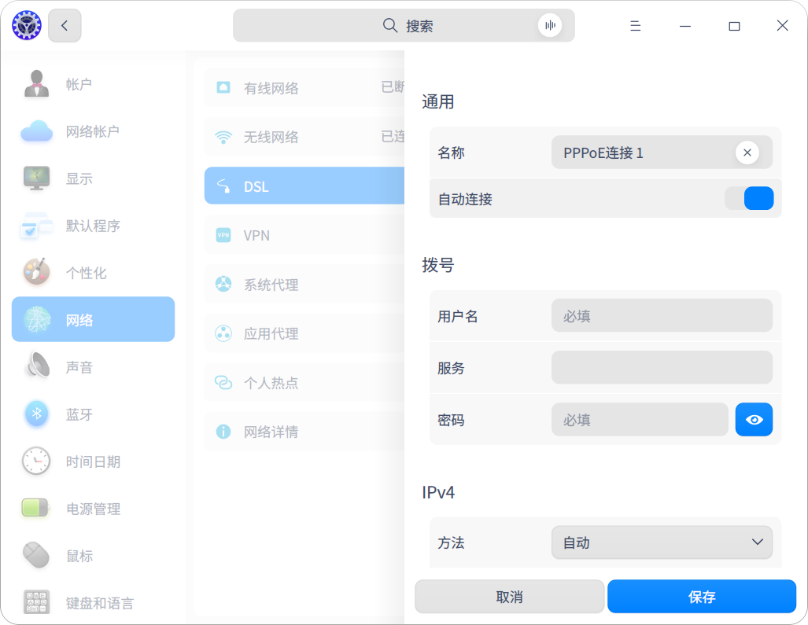
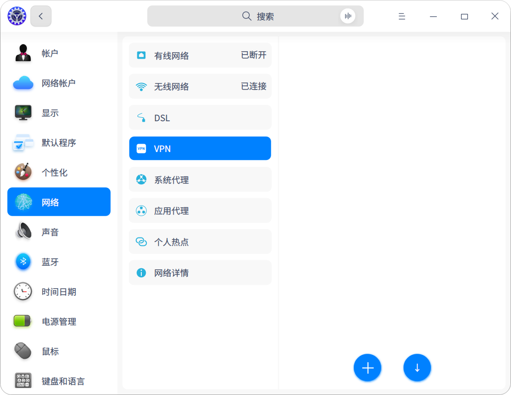
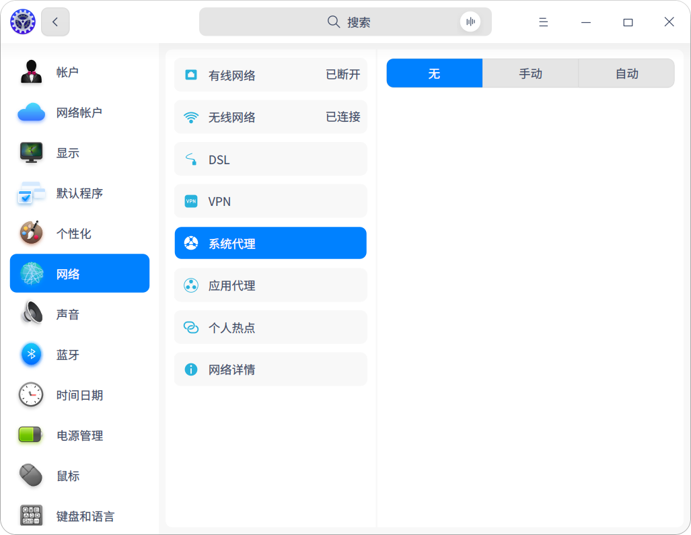
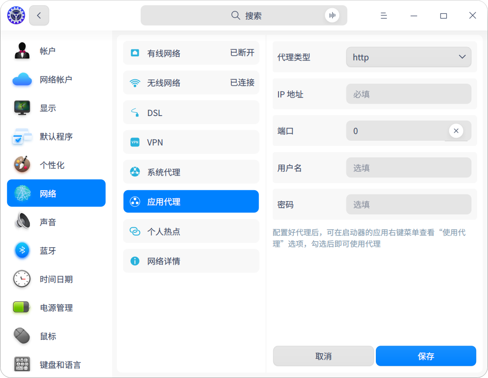

# 连接到Internet

电脑如果没有网络就无法进行大部分的操作，统信UOS有多种连接网络的方法，用户可以根据需求选择相应的方法进行连接。

## 网络设置

登录系统后，电脑需要连接网络，才能进行接收邮件、浏览新闻、下载文件、聊天、网上购物等操作。

### 1.有线网络

有线网络的特点是安全快速稳定，是最常见的网络连接方式。设置好路由器后，把网线两端分别插入电脑和路由器，即可连接有线网络，具体操作如下。

\01. 将网线插入电脑上的网络插孔，将网线的另一端插入路由器或网络端口。

\02. 在控制中心首页，单击【**网络**】按钮 。

\03. 单击【**有线网络**】，进入有线网络设置界面，打开【**有线网卡**】，开启有线网络连接功能，如图所示。当网络连接成功后，桌面上方将弹出“已连接有线连接”的提示信息。

网络设置

> 窍门：单击任务栏托盘区的网络图标，即可查看当前网络状态。

在有线网络设置界面还可以编辑或新建有线网络设置，操作步骤如下。

\01. 在控制中心有线网络设置界面，单击【**添加网络设置**】按钮。

\04. 在弹出的窗口中设置通用、安全、IPv4或者IPv6等信息，如图所示。

\05. 单击【**保存**】按钮，系统自动创建有线连接并尝试连接。

 

有线网络

### 2.无线网络

无线网络与有线网络相比摆脱了线缆的束缚，上网形式更加灵活。

#### （1）连接无线网络

连接无线网络具体操作步骤如下。

\01. 在控制中心网络设置界面，单击【无线网络】进入无线网络设置界面，单击打开【无线网卡】，开启无线网络连接功能，电脑会自动搜索并显示附近可用的无线网络，如图所示。

 

无线网络连接

\01. 单击某个无线网络后的，弹出无线网络设置窗口，可开启【自动连接】，单击【保存】按钮，下次打开【无线网卡】后，电脑可自动连接该无线网络。另外在无线网络设置窗口，单击【取消】按钮，返回无线网络设置界面；单击【删除】按钮，将清除该无线网络配置，下次连接该网络时需要重新输入配置信息，如图所示。

 

无线网络

\01. 选择需要连接的无线网络，此时可能会出现如下两种情况。

¨ 如果该网络是开放的，电脑将自动连接到此网络。

¨ 如果该网络是加密的，需要根据提示输入密码，单击【连接】按钮，电脑将自动完成连接。

#### （2）连接隐藏网络

为了防止他人扫描到个人的WiFi，进而破解WiFi密码连接到个人网络，可以在路由器的设置界面隐藏无线网络并通过控制中心的【连接到隐藏网络】功能连接到隐藏的网络，在路由器中设置隐藏无线网络的操作步骤如下。

\01. 接通路由器电源后，在浏览器地址栏输入路由器背面标签上的网址或IP地址（例如：192.168.1.1），并输入密码等，进入路由器设置界面。

\02. 选择【无线设置】，在无线设置界面基本设置中，开启【信号隐藏】按钮。

在路由器中完成无线网络设置后，用户需要手动连接隐藏网络才能上网，具体操作步骤如下。

\01. 在控制中心无线网络设置界面，单击【连接到隐藏网络】，如图所示。

 

​	连接到隐藏网络

\02. 在弹出的窗口中输入网络名称、SSID和其他必填选项，单击【保存】按钮，如图所示。

 

隐藏网络详细信息设置

### 3.无线热点

无线热点将电脑连接的网络信号转换为WiFi热点，以供一定距离内的其他设备无线上网。如果想要开启无线热点，电脑必须连接到网络并装有无线网卡。

\01. 在控制中心网络设置界面，单击【**个人热点**】。

\02. 如果还未设置过热点，在个人热点设置界面打开【**热点**】，在弹出的窗口中设置热点信息，单击【保存】按钮，即可添加热点，如图所示。如果已添加热点，可单击【添加热点】按钮弹出添加热点窗口进行添加，如图所示。

 

添加热点窗口

个人热点设置

### 4.移动网络

如果周围没有网络信号，可以使用无线上网卡来上网。无线上网卡可以在有电话信号覆盖的任何地方，通过运营商的移动数据网络接入宽带服务。

\01. 将移动网卡插入电脑上的USB接口中，电脑将根据移动网卡和运营商信息，自动适配并连接网络。

\02. 在控制中心网络设置界面，单击【移动网络】即可查看详细设置信息，如图所示。

 

移动网络设置

### 5.拨号网络

拨号上网（DSL）是指通过本地电话拨号连接到网络的连接方式。配置好调制解调器，把电话线插入电脑的网络接口，创建宽带拨号连接，输入运营商提供的用户名和密码，即可拨号连接网络，具体操作步骤如下。

\01. 在控制中心网络设置界面，单击【**DSL**】，单击【创建PPPoE连接】按钮，如图所示。

\02. 在弹出的窗口中输入宽带名称、帐户和密码，单击【**保存**】按钮，系统自动创建宽带连接并尝试连接。

 

DSL设置

### 6.VPN

VPN即虚拟专用网络，其主要功能是在公用网络上建立专用网络进行加密通讯。无论是在外地出差还是在家中办公，只要上网就能利用VPN访问企业的内网资源。控制中心支持手动添加和导入VPN，具体操作步骤如下。

\01. 在控制中心网络设置界面，单击【**VPN**】，在VPN设置界面中单击【添加VPN】按钮，在弹出的窗口中选择VPN协议类型，并输入名称、网关、账号、密码等信息，或单击【导入VPN】按钮，在弹出的文件管理器对话框中选择导入的VPN，系统会自动填充信息，如图所示。

\02. 单击【**保存**】按钮，系统将自动尝试连接VPN网络。

\03. 在添加VPN窗口中，单击【导出】按钮，可以将VPN设置导出备用或共享给其他用户。

 

VPN设置

 说明：在添加VPN窗口打开【仅用于相对应的网络上的资源】开关，可以不将VPN设置为默认路由，只在特定的网络资源上生效。

### 7.系统代理

系统代理服务器是一种特殊的网络服务，它可以代理网络用户去获取网络信息，还可以突破自身IP访问限制，访问国外站点等。设置系统代理服务器的操作方法如下。

\01. 在控制中心网络设置界面，单击【系统代理】，进入系统代理设置界面，如图所示。

\02. 在系统代理设置界面单击【无-保存】，关闭代理服务器功能；单击【手动】，输入代理服务器的地址和端口信息，单击【保存】按钮，手动完成代理服务器信息的配置；单击【自动】，输入URL，单击【保存】按钮，系统将自动配置代理服务器的信息。

 

系统代理

### 8.应用代理

应用代理是指运行在web服务器或某一台单独的主机上的代理服务器应用。它可以实现对网络上的信息进行[监听](https://baike.baidu.com/item/监听/17293)和检测，并对访问[内网](https://baike.baidu.com/item/内网/427841)的数据进行过滤，从而起到隔断内网与[外网](https://baike.baidu.com/item/外网/10515306)的直接通信的作用，保护内网数据安全。设置应用代理的操作步骤如下。

\01. 在控制中心网络设置界面，单击【应用代理】，如图所示。

\02. 在应用代理设置界面中设置应用代理参数，单击【保存】按钮。

 

设置应用代理

说明：应用代理设置成功后，打开启动器，右键单击应用图标，可以选择【使用代理】。

### 9.网络详情

在控制中心网络设置界面，单击【网络详情】，进入网络信息设置界面，可以查看当前连接的有线网络或无线网络的信息，包括MAC、IP地址、网关和其他网络信息等，如图所示。

 

查看网络详情

